# Efficient Target Tracking System Driven by Dragonfly Compound Eye Mechanism (STMD-EMD)

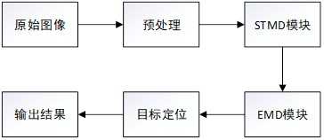

> **Abstract**  
> Inspired by the dragonfly's compound eye vision system, this project implements an efficient bio-inspired target tracking framework. By integrating the Small Target Motion Detector (STMD) and Elementary Motion Detector (EMD) architectures, we simulate key insect vision features such as low-resolution imaging, fast adaptation, and center-surround antagonism. The system achieves high-accuracy and robust tracking of small moving targets under limited computational resources, maintaining real-time performance in complex scenes with cluttered backgrounds and varying lighting conditions. Potential applications include biomedical imaging analysis and micro-robot visual navigation.

---

## 📖 Table of Contents
- [Background](#background)
- [Methodology](#methodology)
  - [Dragonfly Visual Mechanism](#dragonfly-visual-mechanism)
  - [STMD-EMD Architecture](#stmd-emd-architecture)
- [System Architecture](#system-architecture)
  - [Overall Pipeline](#overall-pipeline)
  - [Processing Flow](#processing-flow)
- [Module Details](#module-details)
  - [Data Loading](#data-loading)
  - [Preprocessing](#preprocessing)
  - [STMD-EMD Processing](#stmd-emd-processing)
- [Experiments & Results](#experiments--results)
  - [Preprocessing Output](#preprocessing-output)
  - [STMD Output](#stmd-output)
  - [EMD Output](#emd-output)
  - [Tracking Performance](#tracking-performance)
- [Limitations](#limitations)
- [Future Applications](#future-applications)
- [References](#references)
- [Team](#team)

---

## Background
Target tracking is a fundamental task in computer vision, widely used in video surveillance, robotic navigation, and medical image analysis. Traditional algorithms often struggle with the trade-off between accuracy and efficiency in complex environments. Insect vision systems, such as the dragonfly compound eye, offer advantages in low power consumption and high adaptability, providing inspiration for lightweight and robust tracking solutions.

This project implements a bio-inspired STMD-EMD tracking system based on the dragonfly's visual processing mechanism, aiming to achieve efficient real-time tracking of small targets with limited computational resources.

---

## Methodology

### Dragonfly Visual Mechanism
The dragonfly compound eye consists of thousands of ommatidia, each capturing local image information. Parallel processing enables rapid motion detection. Key features such as low resolution and optical blur—often considered disadvantages—are leveraged in our system to reduce noise and improve processing efficiency.

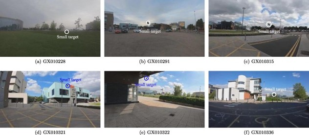

### STMD-EMD Architecture
The system mimics the complete insect visual pathway:
- **STMD (Small Target Motion Detector)**: Detects brightness changes of small targets through ON/OFF channel separation and fast adaptation mechanisms.
- **EMD (Elementary Motion Detector)**: Extracts motion direction and trajectory based on the Hassenstein-Reichardt model for robust localization.

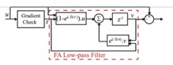
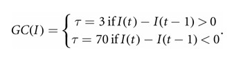

---

## System Architecture

### Overall Pipeline

The system includes the following modules:
1. **Input Module**: Loads image sequences and ground-truth annotations.
2. **Preprocessing Module**: Color channel extraction, Gaussian blur, downsampling, and center-surround antagonism.
3. **STMD Module**: Brightness feature extraction and fast adaptation.
4. **EMD Module**: Motion energy computation and direction estimation.
5. **Localization & Output Module**: Target position determination and performance evaluation.

### Processing Flow
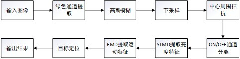

---

## Module Details

### Data Loading
The `read_file_RIST` function loads the RIST dataset images and annotations, performing format conversion and normalization.

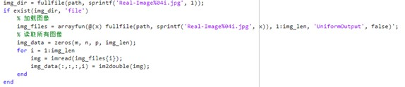

### Preprocessing
Sequential steps:
1. **Green Channel Extraction**: Simulates insect spectral sensitivity.
2. **Gaussian Filtering**: Suppresses high-frequency noise.
3. **Downsampling**: Reduces resolution to match insect visual sampling density.
4. **Center-Surround Antagonism**: Enhances edges and suppresses background.

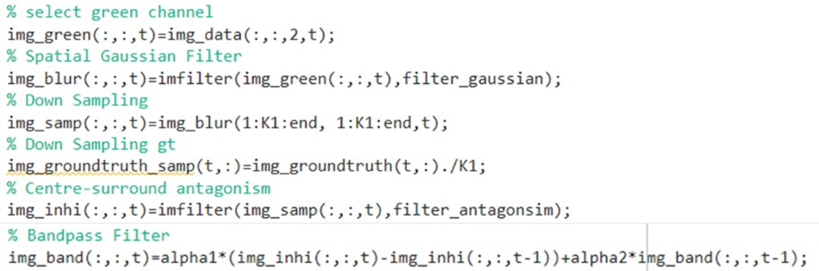
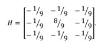
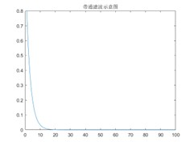

### STMD-EMD Processing
- **STMD Processing**: ON/OFF separation → fast adaptation → size adaptation → delay → cross-channel multiplication.
- **EMD Processing**: Directional difference detection → low-pass filtering → target position estimation.

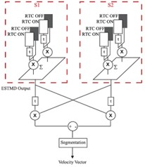
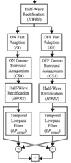
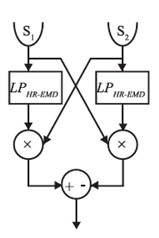

---

## Experiments & Results

### Preprocessing Output
Images after green channel extraction, Gaussian blur, downsampling, and center-surround antagonism show enhanced target-background contrast.

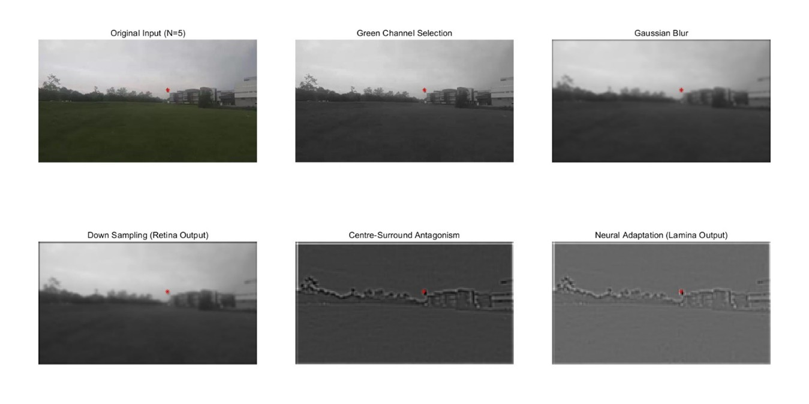

### STMD Output
ON/OFF channel energy maps from the STMD module clearly reflect target brightness variations.

### EMD Output
Horizontal (H) and vertical (V) motion energy maps computed by the EMD module, combined into a final motion energy distribution.

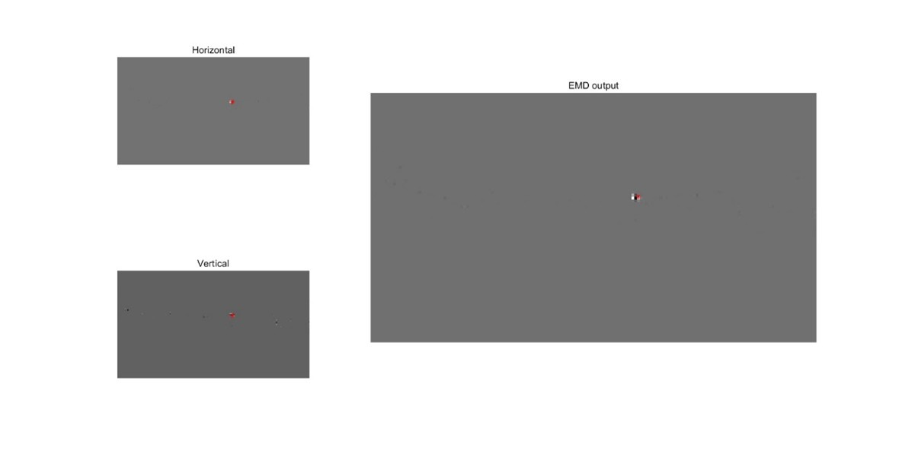

### Tracking Performance
Localization accuracy evaluated using Location Error (LE). The following figures show error distribution and accuracy curves.

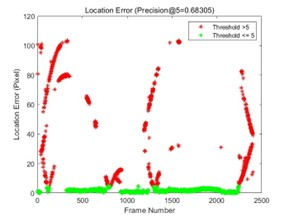
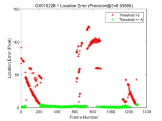
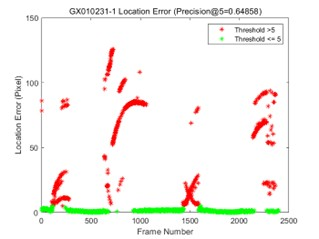

---

## Limitations
1. **Target Size Sensitivity**: Performance degrades for targets outside the tuned size range.
2. **Single-Target Only**: Current implementation does not support multi-target tracking.
3. **Lighting Sensitivity**: Extreme illumination changes may cause false detections or tracking drift.

---

## Future Applications
- **Biomedical Imaging**: Real-time tracking of cell migration, blood flow in microvessels.
- **Micro-Robot Navigation**: Autonomous obstacle avoidance and target following in resource-constrained environments.
- **Ecological Monitoring & Security**: Insect behavior tracking, UAV-based low-altitude target locking.

---

## References
1. Bagheri Z M, et al. *Bioinspiration & Biomimetics*, 2017.
2. RIST Data Set. https://sites.google.com/view/hongxinwang-personalsite/download
3. Wiederman S D, et al. *PLoS ONE*, 2008.
4. Lancer B H, et al. *Communications Biology*, 2022.
5. Additional references are listed in the full report.

---

## Team
- Niu Xinyue
- Shen Wenbo
- Liang Haiqi
- Huo Shengyu

**Supervisor**: Liu Shupeng  
**Date**: May 12, 2025  
**Course**: Micro‑Noninvasive Diagnosis & Treatment Instruments and Technology (12295009) | Shanghai University Spring 2025‑2026

---
> Source code and detailed experimental data are available in this repository. Star ⭐ and Fork 🔀 are welcome!

---
